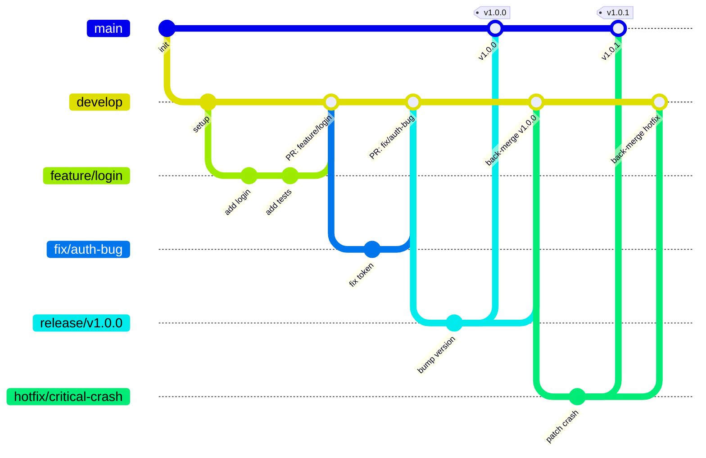

# 🌿 Gitflow Strategy

This project follows a structured Gitflow to ensure safe, predictable releases.

## Branch Model

| Branch | Purpose | Created From | Merges Into |
|---|---|---|---|
| `main` | Production code | — | — |
| `develop` | Integration branch | `main` | — |
| `feature/*` | New features | `develop` | `develop` |
| `fix/*` | Bug fixes | `develop` | `develop` |
| `refactor/*` | Code refactoring | `develop` | `develop` |
| `chore/*` | Maintenance tasks | `develop` | `develop` |
| `doc/*` | Documentation | `develop` | `develop` |
| `release/vX.X.X` | Release preparation | `develop` | `main` + `develop` |
| `hotfix/*` | Critical production fixes | `main` | `main` + `develop` |

## Rules

- ✅ PRs to `main` → only from `release/vX.X.X` or `hotfix/*`
- ✅ PRs to `develop` → only from `feature/*`, `fix/*`, `refactor/*`, `chore/*`, `doc/*`
- ✅ `release/vX.X.X` branches → only created from `develop`
- ✅ After merging `release` or `hotfix` into `main` → back-merge into `develop`
- ✅ Every merge into `main` → tagged as `vX.X.X`

## Diagram



## Naming Conventions

Branch names must follow these patterns:

```bash
feature/short-description
fix/short-description
refactor/short-description
chore/short-description
doc/short-description
release/v1.2.3
hotfix/short-description
```

> ❌ Invalid: `my-branch`, `Feature-Login`, `fix_auth`
> ✅ Valid: `feature/user-auth`, `fix/token-expiry`, `release/v2.1.0`