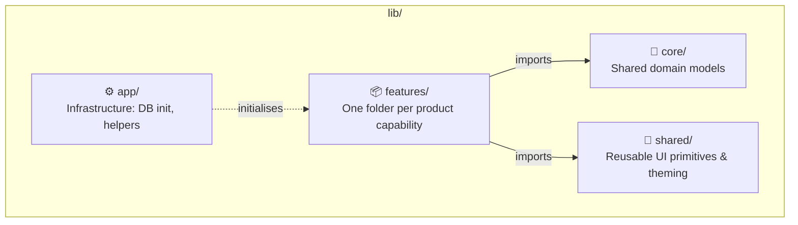
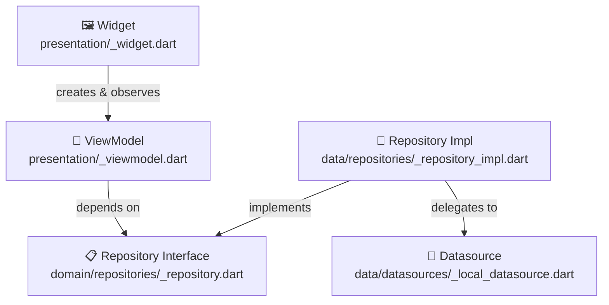
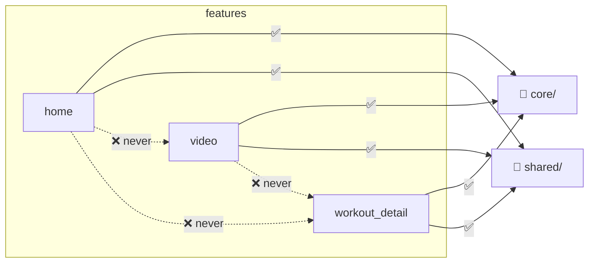
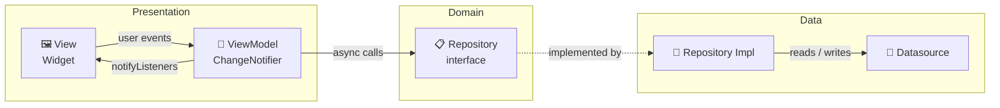
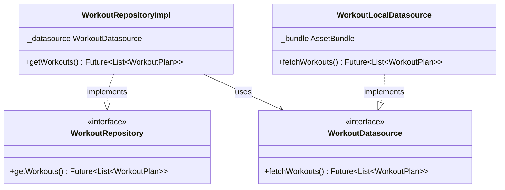
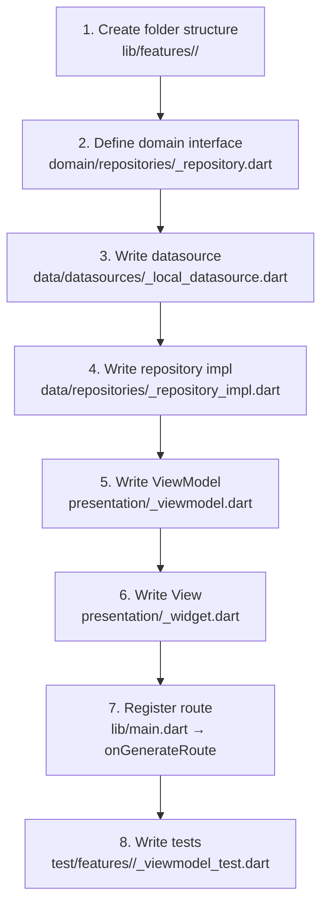
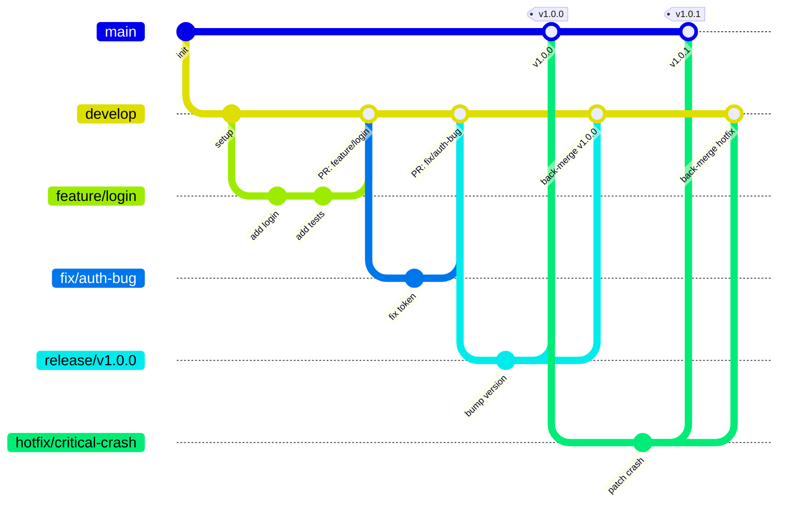

# Contributing

---

## Table of Contents

1. [Project Architecture](#-project-architecture)
2. [Feature-first Pattern](#-feature-first-pattern)
3. [MVVM](#-mvvm)
4. [Data Layer](#-data-layer)
5. [Adding a New Feature](#-adding-a-new-feature)
6. [Gitflow Strategy](#-gitflow-strategy)

---

## 🏗 Project Architecture

The codebase is split into four top-level zones inside `lib/`. Each zone has a single, non-overlapping responsibility.



Static assets live at the **project root**, never inside `lib/`:

```
assets/
├── data/        ← JSON fixtures  (workouts.json)
└── image/       ← images and SVGs
```

**Dependency rule:** `features` may import from `core` and `shared`. No other cross-zone imports are allowed.

---

## 📦 Feature-first Pattern

Every product capability lives in its own self-contained folder under `lib/features/`. A feature owns its entire vertical slice — from data access up to the screen widget — so that adding, removing, or replacing a feature never bleeds into unrelated code.

### Anatomy of a feature



### Folder layout

```
lib/features/<feature>/
├── data/
│   ├── datasources/
│   │   ├── <entity>_datasource.dart          # abstract contract
│   │   └── <entity>_local_datasource.dart    # concrete implementation
│   └── repositories/
│       └── <feature>_repository_impl.dart
├── domain/
│   └── repositories/
│       └── <feature>_repository.dart         # abstract interface
├── model/                                    # feature-local models, if any
└── presentation/
    ├── <feature>_viewmodel.dart
    ├── <feature>_widget.dart                 # screen entry point
    └── widget/                               # sub-widgets local to this feature
```

### Import rules



---

## 🔄 MVVM

Each feature follows **Model → ViewModel → View**, with a strict one-way dependency chain.



### Model

Plain Dart classes representing business data. No Flutter imports, no state. Shared models live in `lib/core/domain/models/`; feature-local ones go in `<feature>/model/`.

```dart
// lib/core/domain/models/workout_plan.dart
class WorkoutPlan extends Model {
  final String id;
  final String name;
  final List<DifficultyTier> levels;
  // ...
}
```

### ViewModel

A `ChangeNotifier` that holds all screen state and exposes it as read-only getters. It calls the repository to load or mutate data. **No widget or `BuildContext` imports.**

```dart
// lib/features/home/presentation/home_viewmodel.dart
class HomeViewModel extends ChangeNotifier {
  final WorkoutRepository _repository;   // ← interface, not a concrete class

  HomeViewModel(this._repository);

  List<WorkoutPlan> _workouts = [];
  List<WorkoutPlan> get workouts => _workouts;

  bool _isLoading = true;
  bool get isLoading => _isLoading;

  Future<void> loadWorkouts() async {
    try {
      _workouts = await _repository.getWorkouts();
    } catch (e) {
      _error = e.toString();
    } finally {
      _isLoading = false;
      notifyListeners();    // ← only way to communicate back to the View
    }
  }
}
```

Rules:
- No `BuildContext`, no widget imports.
- Every state mutation ends with `notifyListeners()`.
- Business logic (filtering, sorting, validation) belongs here, never in the widget.
- Dependencies come in via constructor — never instantiated internally.

### View

A `StatefulWidget` that owns a ViewModel and rebuilds in response to it. It **renders** state; it never **computes** it.

```dart
// lib/features/home/presentation/home_widget.dart
class _HomeWidgetState extends State<HomeWidget> {
  late final HomeViewModel _viewModel;

  @override
  void initState() {
    super.initState();
    // Concrete wiring in one place — the View is the composition root
    _viewModel = HomeViewModel(WorkoutRepositoryImpl(WorkoutLocalDatasource()));
    _viewModel.init();
  }

  @override
  Widget build(BuildContext context) {
    return ListenableBuilder(
      listenable: _viewModel,
      builder: (context, _) {
        if (_viewModel.isLoading) return Loading();
        return _buildGrid();    // ← reads state, never changes it
      },
    );
  }
}
```

Rules:
- Use `ListenableBuilder` / `ValueListenableBuilder` to react to changes.
- Never call `setState` for business state — that belongs in the ViewModel.
- Instantiate the ViewModel once in `initState`; dispose it in `dispose`.

---

## 🗄 Data Layer

The data layer sits between the ViewModel and the actual storage. Its job is to keep the ViewModel **testable** by hiding implementation details behind interfaces.

### Domain vs Data

`domain` defines **what** — contracts and models that are agnostic to any technology or framework.

`data` is the **infrastructure layer**. It defines **how** — it implements the domain contracts using real technical code (HTTP clients, Hive, SQLite, asset bundles).

The dependency is strictly one-directional:

```
presentation → domain ← data
```

`data` knows `domain` (it implements its interfaces), but `domain` never knows `data`. This isolation means you can replace Hive with SQLite, or swap a local datasource for a remote API, without touching the domain or presentation layers.

### Components



| File | Role |
|---|---|
| `domain/repositories/<name>_repository.dart` | Abstract interface — the boundary the ViewModel crosses. Domain types only. |
| `data/datasources/<entity>_datasource.dart` | Abstract interface — decouples storage mechanism from business logic. |
| `data/datasources/<entity>_local_datasource.dart` | The only class that knows where data actually lives (JSON, Hive, API…). |
| `data/repositories/<name>_repository_impl.dart` | Wires the datasource to the domain interface. |

### Why two interfaces?

The **repository interface** lets you mock at the ViewModel test level — fast, zero I/O:

```dart
class _FakeWorkoutRepository implements WorkoutRepository {
  @override
  Future<List<WorkoutPlan>> getWorkouts() async => [/* stubs */];
}

final vm = HomeViewModel(_FakeWorkoutRepository());
```

The **datasource interface** lets you swap backends (local JSON → REST API) without touching the ViewModel or its tests.

### Source-of-truth rule

| Data | Source of truth |
|---|---|
| Content (workouts, exercises) | JSON / remote API |
| User state (favourites, progress) | Hive (keyed by entity ID) |

Never embed user state inside a content model. They have different lifecycles and must evolve independently.

---

## ➕ Adding a New Feature



### Checklist

**Structure**

```
lib/features/<name>/
├── data/datasources/
├── data/repositories/
├── domain/repositories/
└── presentation/widget/
```

**Domain interface**

```dart
abstract class <Name>Repository {
  Future<SomeModel> getSomething();
}
```

**Datasource**

```dart
class <Name>LocalDatasource implements <Name>Datasource {
  @override
  Future<SomeModel> fetchSomething() async { /* ... */ }
}
```

**Repository impl**

```dart
class <Name>RepositoryImpl implements <Name>Repository {
  final <Name>Datasource _datasource;
  <Name>RepositoryImpl(this._datasource);

  @override
  Future<SomeModel> getSomething() => _datasource.fetchSomething();
}
```

**ViewModel**

```dart
class <Name>ViewModel extends ChangeNotifier {
  final <Name>Repository _repository;
  <Name>ViewModel(this._repository);
  // state + methods
}
```

**View — wire in `initState`**

```dart
_viewModel = <Name>ViewModel(<Name>RepositoryImpl(<Name>LocalDatasource()));
```

**Tests — inject a fake repository**

```dart
class _Fake<Name>Repository implements <Name>Repository {
  @override
  Future<SomeModel> getSomething() async => SomeModel(/* stub */);
}

final vm = <Name>ViewModel(_Fake<Name>Repository());
```

---

## 🌿 Gitflow Strategy

This project follows a structured Gitflow to ensure safe, predictable releases.

### Branch Model

| Branch | Purpose | Created From | Merges Into |
|---|---|---|---|
| `main` | Production code | — | — |
| `develop` | Integration branch | `main` | — |
| `feature/*` | New features | `develop` | `develop` |
| `fix/*` | Bug fixes | `develop` | `develop` |
| `refactor/*` | Code refactoring | `develop` | `develop` |
| `chore/*` | Maintenance tasks | `develop` | `develop` |
| `doc/*` | Documentation | `develop` | `develop` |
| `release/vX.X.X` | Release preparation | `develop` | `main` + `develop` |
| `hotfix/*` | Critical production fixes | `main` | `main` + `develop` |

### Rules

- ✅ PRs to `main` → only from `release/vX.X.X` or `hotfix/*`
- ✅ PRs to `develop` → only from `feature/*`, `fix/*`, `refactor/*`, `chore/*`, `doc/*`
- ✅ `release/vX.X.X` branches → only created from `develop`
- ✅ After merging `release` or `hotfix` into `main` → back-merge into `develop`
- ✅ Every merge into `main` → tagged as `vX.X.X`

### Diagram



### Naming Conventions

```
feature/short-description
fix/short-description
refactor/short-description
chore/short-description
doc/short-description
release/v1.2.3
hotfix/short-description
```

> ❌ Invalid: `my-branch`, `Feature-Login`, `fix_auth`
> ✅ Valid: `feature/user-auth`, `fix/token-expiry`, `release/v2.1.0`
