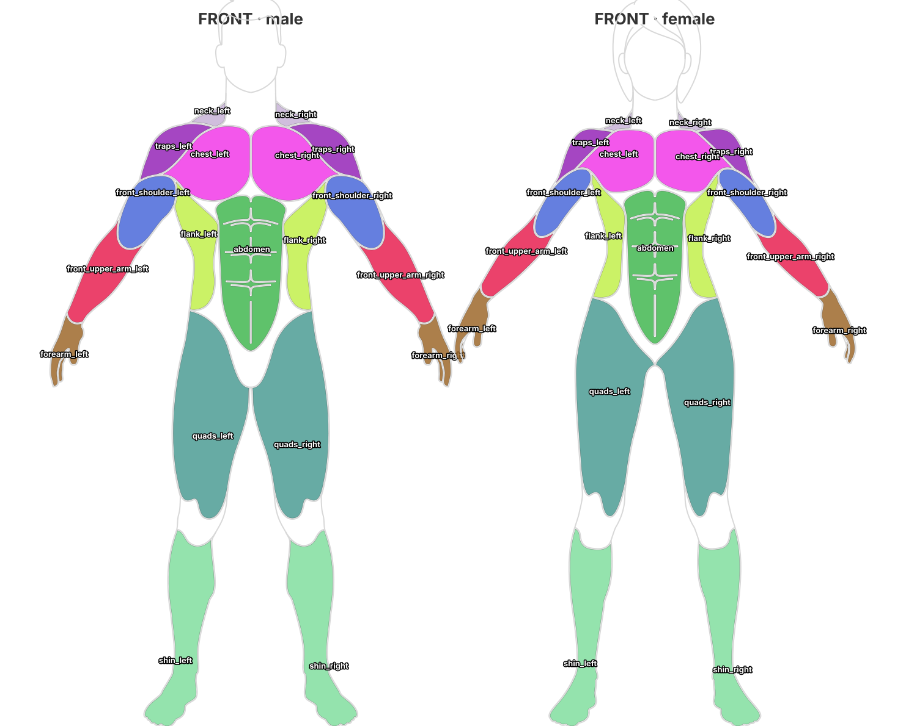
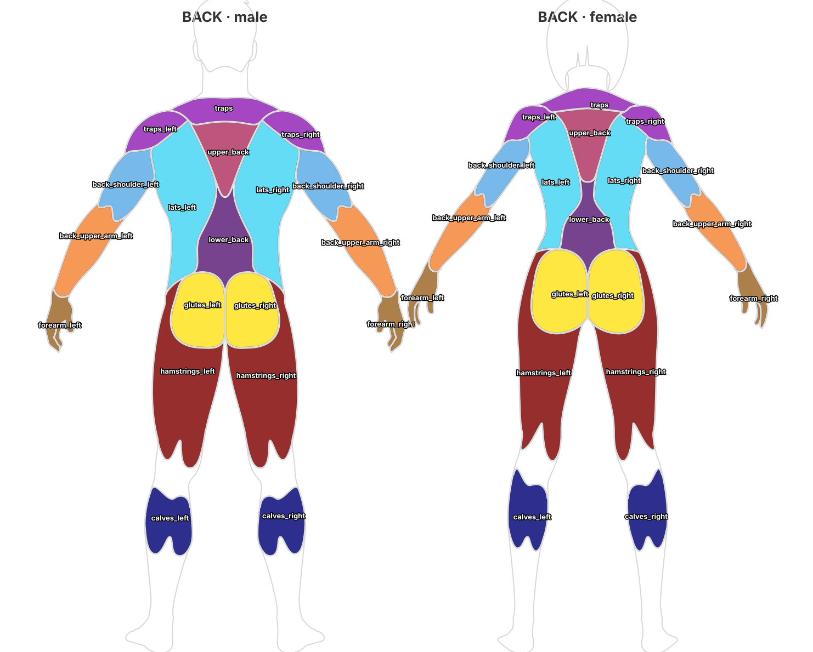

# Body Map

Shades a human figure by how much each **body region** has been trained, so the
user can see at a glance what they are hitting and what they are neglecting.

Train chest → the chest area turns red. Nothing on the back → it stays grey.

---

## 1. Regions, not muscles

The SVG art is drawn at **region fidelity**, not anatomical-atlas fidelity. A
blob covers "the area between the shoulder blades", not "the middle trapezius
with its exact borders". So the domain vocabulary is `BodyRegion`, and a region
can contain several muscles:

| Region | Contains (roughly) |
| --- | --- |
| `upperBack` | trapézio médio, romboides, infraespinal |
| `lowerBack` | trapézio inferior, lombar |
| `flank` | oblíquos, serrátil anterior |
| `traps` | trapézio superior (a rampa pescoço → ombro, visível de frente e de costas) |
| `quads` | quadríceps |
| `hamstrings` | isquiotibiais |
| `calves` | gastrocnêmio, sóleo |
| `shin` | tibial anterior |

Naming this "muscle map" was the original mistake: it promised a precision the
drawing cannot deliver, and every path whose `id` named a specific muscle was
wrong about where it actually sat.

---

## 2. The region contract

Each view exposes a fixed set of regions, and **male and female expose exactly
the same set**. Only the shapes differ (the female figure is smaller). Nothing
downstream branches on `BodySex`.

**Front (10)**

`neck` · `traps` · `front_shoulder` · `chest` · `front_upper_arm` · `forearm` ·
`abdomen` · `flank` · `quads` · `shin`

**Back (10)**

`traps` · `back_shoulder` · `upper_back` · `lower_back` · `lats` ·
`back_upper_arm` · `forearm` · `glutes` · `hamstrings` · `calves`

`traps` and `forearm` appear in both views; everything else is view-specific.

### The shoulder → hand chain

Front and back use the same four-link chain, at the same coordinates on the
canvas — the deltoid sits in the same place whether you look at it from the
front or the back:

```
traps  →  front_shoulder / back_shoulder  →  front_upper_arm / back_upper_arm  →  forearm
```

### Naming rule

> **Use the single common word when one exists and is unambiguous. Fall back to
> `front_` / `back_` + body segment only when it does not.**

| One word is enough | Needs a prefix | Why |
| --- | --- | --- |
| `neck` `chest` `abdomen` `flank` `forearm` `glutes` `quads` `hamstrings` `shin` `calves` `lats` `traps` | `front_shoulder` / `back_shoulder` | the deltoid has distinct front and back heads |
| | `front_upper_arm` / `back_upper_arm` | "upper arm" alone does not say which face |
| | `upper_back` / `lower_back` | the back has three zones |

This is why the list mixes location words (`chest`, `shin`) with training-group
words (`quads`, `lats`). It is deliberate, not an oversight — renaming `quads`
to `front_thigh` or `shin` to `front_lower_leg` would be more verbose with no
gain in precision. `shin` is the exact structural peer of `forearm`: both are
ordinary English region words for the front face of a limb segment.

Two names that get "corrected" wrongly if you only read the enum:

- **`lats` is *lateral*, not *middle*.** It does not sit between `upper_back`
  and `lower_back` — it flanks both. Measured on the art, `lats` spans
  `y 232-539` down the sides, covering the same height as `upper_back`
  (`y 234-368`) plus `lower_back` (`y 353-537`) combined, which are both
  central. Renaming it `mid_back` would misstate where it is; `lateral_back`
  would be accurate but reads worse in a training UI.
- **`traps` is not a synonym for `upper_back`.** They are two different regions
  in this map: `traps` is the neck band plus the slope over each shoulder,
  `upper_back` is the patch between the shoulder blades.

---

## 3. SVG id convention

Region paths in `assets/image/svg/*_muscle_map_*.svg` carry an `id`:

| Kind | Pattern | Example |
| --- | --- | --- |
| Paired | `<region>_left` / `<region>_right` | `forearm_left`, `back_upper_arm_right` |
| Midline | `<region>` (no suffix — it has no pair) | `abdomen`, `traps`, `upper_back`, `lower_back` |

Everything else in the file — the figure silhouette and the shading detail
lines — carries `stroke="#FF0000"` and no `id`, and is merged into a single
non-interactive outline path.

`BodyRegion.svgId` is the source of truth for these names;
`BodyRegion.fromSvgId` resolves them back.

### Front



### Back



---

## 4. Data flow

```
assets/data/workouts.json          plan.primaryRegions: [glutes, quads, hamstrings]
        │
        ▼
ComputeRegionStressUseCase         favorited plans → Map<BodyRegion, int>  (1-10)
        │                          (workout owns "what stresses what")
        ▼
BodyMapViewModel.applyStress       stores the map, notifies
        │
        ▼
BodyMapPainter                     StressLevel.fromLevel(n) → fill colour
```

`workout` and `body_map` never import each other's internals — they meet on
`BodyRegion`, which lives in `core/domain/models`. `WorkoutModule.computeRegionStress()`
is the seam.

Stress tiers (`StressLevel`): `none` 0 · `low` 1-3 · `medium` 4-6 · `high` 7-10.

---

## 5. Layout

```
lib/features/body_map/
├── data/
│   ├── datasources/body_map_asset_datasource.dart   parses the SVGs
│   └── repositories/body_map_repository_impl.dart   caches per (side, sex)
├── domain/
│   ├── models/body_region_data.dart                 region + side + Path
│   ├── models/body_side.dart                        front | back
│   ├── models/figure_outline_path_data.dart         the grey silhouette
│   └── repositories/body_map_repository.dart
├── presentation/
│   ├── body_map_viewmodel.dart
│   ├── body_map_widget.dart
│   └── widget/{body_map_painter,body_side_toggle,stress_legend}.dart
└── docs/                                            diagrams used by this README
```

Shared vocabulary in `lib/core/domain/models/`: `BodyRegion`, `RegionSide`,
`StressLevel`, `BodySex`.

---

## 6. Editing the art

The four assets share one canvas: `viewBox="0 0 661 1207"` (see `kBodyMapWidth`
/ `kBodyMapHeight`).

When you touch an SVG:

1. Keep the `id` convention above — a typo makes the path fall through to the
   outline and it silently stops being shadeable.
2. Keep male and female in sync. Same region ids, same view.
3. A paired region needs **both** `_left` and `_right`.
4. Run `flutter test test/features/body_map/body_map_asset_contract_test.dart`
   — it parses all four assets and fails on a missing region, an unknown id, a
   half-drawn pair, or male/female drift.
5. Regenerate the diagrams in `docs/` if the regions changed.

### Known rough edges in the current art

The names now match where each shape actually sits, but some shapes are still
crude — they were hand-drawn approximations:

- `back_shoulder` and `back_upper_arm` on the male back are noticeably chunkier
  than the female equivalents.
- `flank` is a coarse slab rather than following the oblique/serratus border.
- `neck` is a small wedge and reads more like the top of the trapezius.

None of this breaks the region contract; it is a quality-of-art backlog item.

---

## 7. Backlog — coverage gaps

The naming is settled; what is still missing is **coverage**. These need new
paths drawn on all four assets, so they are art work, not a rename:

| Missing region | Exercises that currently have nowhere to shade | Priority |
| --- | --- | --- |
| **adductors** (inner thigh) | sumo squat, lunge, adductor machine, cossack squat | high — legs are the most trained area |
| **abductors / gluteus medius** (outer hip) | hip abduction, band walk, side-lying raise | high |
| back of the neck | neck extension | low |

Smaller splits that would sharpen the map but are not blocking anything:

- `chest` has no upper/lower split — incline and decline press shade identically.
- `glutes` has no maximus/medius split.
- `forearm` includes the hand, so grip work has no target of its own.

When adding a region: add the enum value in `BodyRegion`, draw the paths in all
four SVGs following the id convention in §3, extend `_frontRegions` /
`_backRegions` in the contract test, and regenerate `docs/`.
